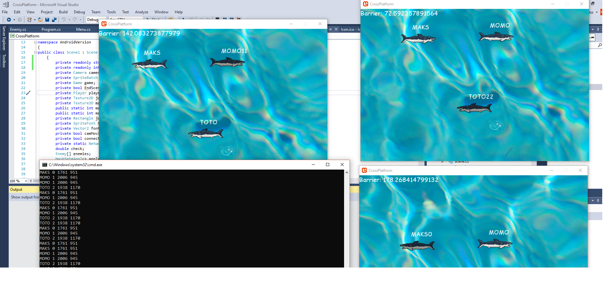
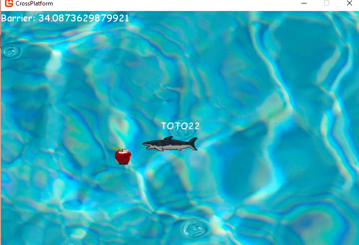

# Hungry Shark Multiplayer Game
Windows/Linux Android game with shared code

Project created for Game Development Course with learning purpose.

Technologies used:

- C# with .NET as the programming enviroment
- Monogame framework to handle graphics
- Lidgren library to handle network connections ( UDP Protocol ).
- Mono ( to run the game on linux enviroment).

Purpose of the game is to feed your shark (with apples ;))) and get grow up and speed up over the opponents to later eat them ( eating opponents wasn't implemented).

Requirements:
- The game should run on Windows, Linux and Android systems.
- The server should handle connections with clients and handle such data like each clients positions, as well as data about apples + spawning new apples when they get eaten.
- Maximize the amount of shared code used by different architectures.

To install:
* Server: 
The server project located in another repository https://github.com/maksimlya/CrossPlatformGame.Server 
Can run on any .Net capable machine ( Tested on visual studio 17 under windows and MonoDevelop/ Rider IDE under Linux).
The Server listens by default on port 15000, so make sure that port is open in your firewall (or change it).

* Client: 
  - Windows: Install visual studio 2017, Monogame framework extension for visual studio, open in visual studio and build the 'CrossPlatform project', run it, after entering the name phase the client should connect to the server ( if apples being spawned, means that client is connected). It is also possible to run the android version of the game in built-in emulator of visual studio (additional installation is required).
  - Linux: Install MonoDevelop or Rider, install .Net on your particular linux distro, install monogame, rest of the process should be same as windows, thought you can just delete the AndroidVersion from it. Also to run the executables under linux run from command line "mono myGame.exe".
  - Android: Must install all the stuff for visual studio, including android, java and android emulator. Later open the project and build the 'AndroidVersion' (most of the code is re-used from original version with added joystick controller and some small stuffs like resolution), and in 'build' directory you will get the .apk file you can install on your mobile phone or run on any android emulator.
  
  Some screenshots from the game:
  
  
